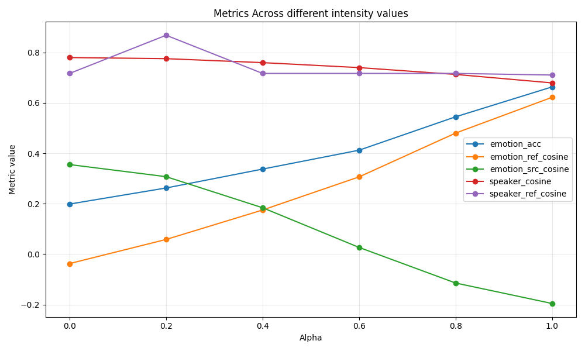
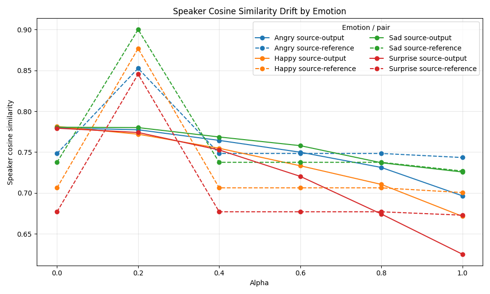
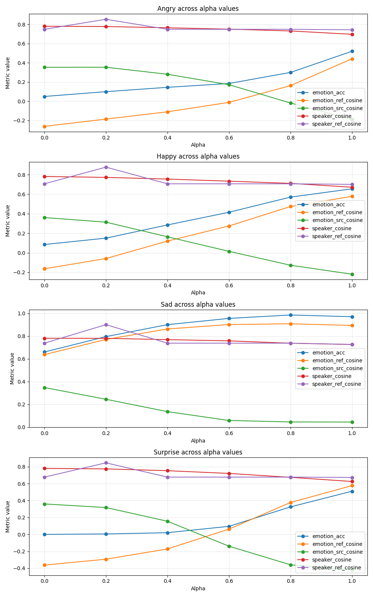
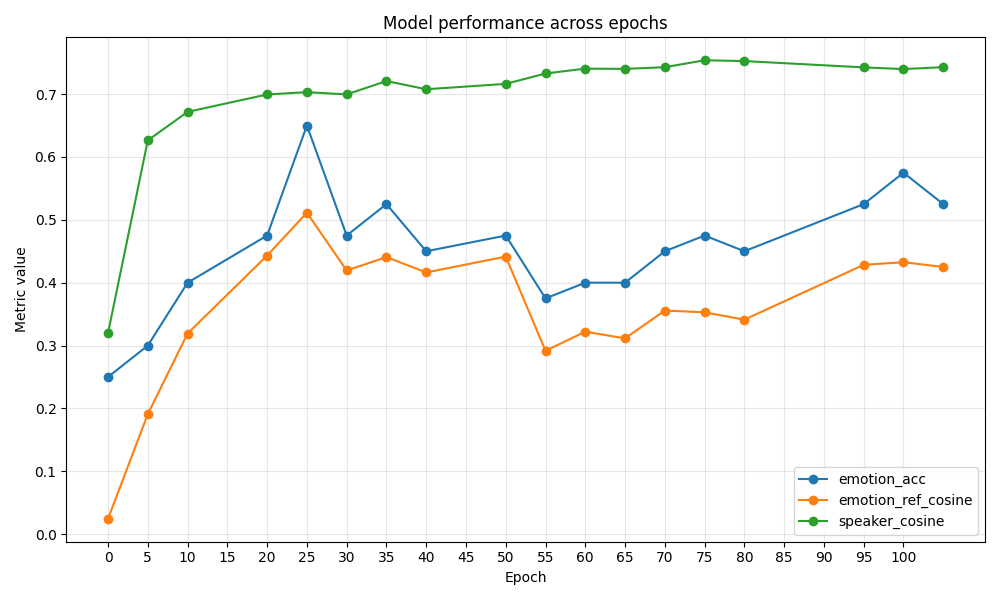
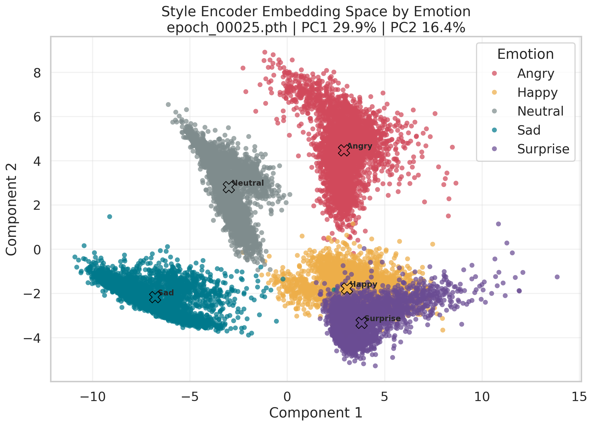
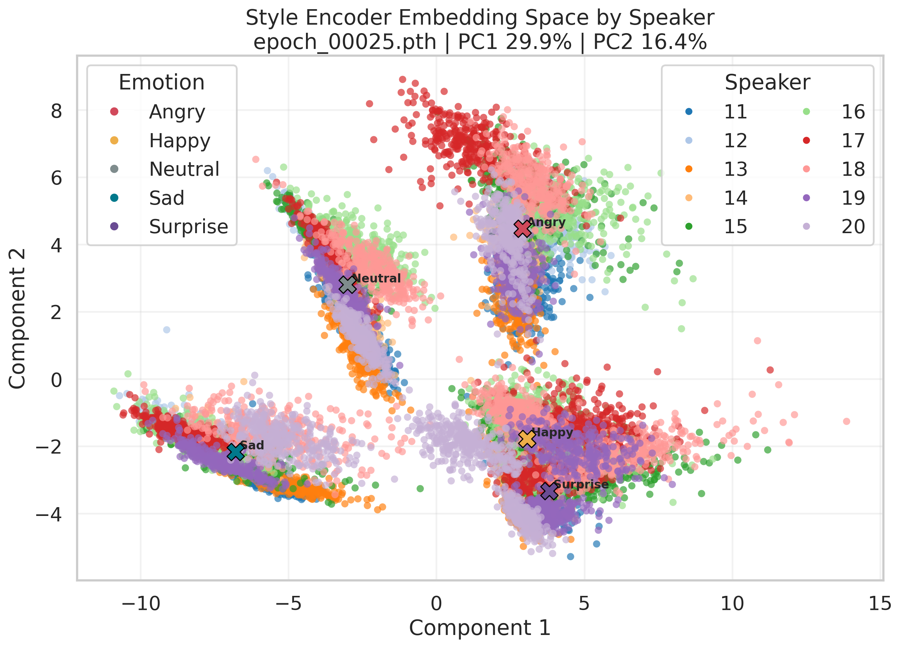

# Model Inferred Intensity Alpha Critique

**Summary**: The `MODEL_inferred_intensity` experiments show a clear alpha-controlled tradeoff: increasing inferred style intensity improves target-emotion accuracy and reference-emotion similarity, while reducing source-speaker cosine. The result is useful evidence for an emotion-speaker frontier, but it is currently limited to same-speaker, same-text conversions and should not be overclaimed as cross-speaker EVC speaker drift.

**Sources**:
- `exp/MODEL_inferred_intensity/updated/alpha_metrics_summary.csv`
- `exp/MODEL_inferred_intensity/updated/alpha_metrics_by_emotion_summary.csv`
- `exp/MODEL_inferred_intensity/updated/intensity_per_sample_metrics.csv`
- `exp/MODEL_inferred_intensity/updated/full_eval_epoch_00025_alpha_0.0_20260503_151305/overall_metrics.csv`
- `exp/MODEL_inferred_intensity/updated/full_eval_epoch_00025_alpha_0.2_20260503_155350/overall_metrics.csv`
- `exp/MODEL_inferred_intensity/updated/full_eval_epoch_00025_alpha_0.4_20260503_151540/overall_metrics.csv`
- `exp/MODEL_inferred_intensity/updated/full_eval_epoch_00025_alpha_0.6_20260503_153035/overall_metrics.csv`
- `exp/MODEL_inferred_intensity/updated/full_eval_epoch_00025_alpha_0.8_20260503_153553/overall_metrics.csv`
- `exp/MODEL_inferred_intensity/updated/full_eval_epoch_00025_alpha_1.0_20260507_134444/overall_metrics.csv`
- `exp/MODEL_inferred_intensity/proxy_epoch_variants/overall_metrics_comparison.csv`
- `exp/MODEL_inferred_intensity/style_embedding_viz_epoch_00025/projection_pca.csv`
- `exp/MODEL_inferred_intensity/updated/alpha_metrics_comparison.png`
- `exp/MODEL_inferred_intensity/updated/alpha_metrics_by_emotion.png`
- `exp/MODEL_inferred_intensity/updated/alpha_speaker_cosine_drift.png`
- `exp/MODEL_inferred_intensity/proxy_epoch_variants/metrics_comparison.png`
- `exp/MODEL_inferred_intensity/style_embedding_viz_epoch_00025/style_space_pca_by_emotion.png`
- `exp/MODEL_inferred_intensity/style_embedding_viz_epoch_00025/style_space_pca_by_speaker.png`

**Last updated**: 2026-05-07

---

## Scope

This critique covers the `MODEL_inferred_intensity` experiment family. The most interpretable subset is the epoch-25 alpha sweep over `alpha = 0.0, 0.2, 0.4, 0.6, 0.8, 1.0`, with 800 samples per alpha and 200 samples per target emotion (source: `exp/MODEL_inferred_intensity/updated/intensity_per_sample_metrics.csv`; source: `exp/MODEL_inferred_intensity/updated/alpha_metrics_by_emotion_summary.csv`).

All alpha-sweep rows are labeled `pair_type = same_speaker_same_text`, so this experiment measures emotional conversion strength versus same-speaker preservation rather than cross-speaker target identity conversion (source: `exp/MODEL_inferred_intensity/updated/intensity_per_sample_metrics.csv`). This is important for [[speaker-emotion-tradeoff]]: the experiment supports a within-speaker emotion-speaker stability frontier, but it does not yet prove how the method behaves in many-to-many cross-speaker EVC.

## Main Finding

Increasing alpha produces a near-monotonic improvement in emotion conversion while reducing source-speaker similarity. Emotion accuracy rises from 0.19875 at alpha 0.0 to 0.66375 at alpha 1.0, and emotion-reference cosine rises from -0.0375 to 0.6224 (source: `exp/MODEL_inferred_intensity/updated/alpha_metrics_summary.csv`). Over the same sweep, source-speaker cosine falls from 0.7802 to 0.6796, a drop of about 0.1006 absolute or 12.9% relative to alpha 0.0 (source: `exp/MODEL_inferred_intensity/updated/alpha_metrics_summary.csv`).

This is the cleanest local evidence so far that stronger target-emotion expression comes with measurable speaker drift. It directly fills the gap noted in [[speaker-emotion-tradeoff]], where the wiki says the literature often reports speaker and emotion metrics together but rarely traces a controlled frontier.

## Visual Evidence

Figure 1 shows the main frontier visually: emotion accuracy and emotion-reference cosine rise with alpha, emotion-source cosine falls, and source-speaker cosine declines more gradually (source: `exp/MODEL_inferred_intensity/updated/alpha_metrics_comparison.png`). The purple `speaker_ref_cosine` line also makes the alpha 0.2 anomaly visible, which reinforces the caution that this metric should be audited before being used as primary evidence (source: `exp/MODEL_inferred_intensity/updated/alpha_metrics_comparison.png`).

Figure 2 shows that the source-output speaker cosine decline is emotion-dependent, with Surprise dropping most strongly by alpha 1.0 and Sad remaining comparatively stable (source: `exp/MODEL_inferred_intensity/updated/alpha_speaker_cosine_drift.png`). The dashed source-reference lines also expose the same reference-side irregularity seen in the summary table, especially the alpha 0.2 spike (source: `exp/MODEL_inferred_intensity/updated/alpha_speaker_cosine_drift.png`).

Figure 3 shows why the aggregate curve should not be overread: Sad reaches high accuracy and high emotion-reference cosine early, while Angry and Surprise need high alpha and still lag behind Sad (source: `exp/MODEL_inferred_intensity/updated/alpha_metrics_by_emotion.png`). This supports an emotion-specific frontier rather than a single universal alpha setting.

## Alpha Sweep Interpretation

The alpha sweep behaves like an intensity knob. As alpha increases, emotion-reference cosine increases almost linearly, while emotion-source cosine decreases from 0.3554 to -0.1960 (source: `exp/MODEL_inferred_intensity/updated/alpha_metrics_summary.csv`). That pattern is exactly what an emotion-control variable should do: move generated speech away from the neutral/source emotional representation and toward the target/reference emotional representation.

The tradeoff is not uniform across the alpha range. The first step, alpha 0.0 to 0.2, gives a modest emotion-accuracy gain of 0.0638 for only 0.0043 speaker-cosine loss, while the last step, alpha 0.8 to 1.0, gives 0.1188 emotion-accuracy gain for 0.0336 speaker-cosine loss (source: `exp/MODEL_inferred_intensity/updated/alpha_metrics_summary.csv`). This suggests alpha 0.2 is a conservative setting, alpha 0.6-0.8 is the practical middle of the curve, and alpha 1.0 is the best emotion setting but also the highest drift setting.

## Emotion-Specific Behavior

The model is not equally controllable for all emotions. Sad is already strong at alpha 0.0 with 0.66 accuracy and reaches 0.97 accuracy at alpha 1.0, while Angry begins at 0.05 and reaches 0.52, Happy begins at 0.085 and reaches 0.655, and Surprise begins at 0.0 and reaches 0.51 (source: `exp/MODEL_inferred_intensity/updated/alpha_metrics_by_emotion_summary.csv`).

Surprise has the largest speaker-cosine drop, from 0.7792 to 0.6250, while Sad has the smallest drop, from 0.7805 to 0.7256 (source: `exp/MODEL_inferred_intensity/updated/alpha_metrics_by_emotion_summary.csv`). This means the tradeoff is emotion-dependent: difficult or acoustically extreme emotions may require larger speaker compromise.

The confusion matrices show a strong bias toward Sad at low alpha. At alpha 0.0, 65.0-68.5% of samples across all target emotions are predicted as Sad, and Surprise is never correctly predicted (source: `exp/MODEL_inferred_intensity/updated/intensity_per_sample_metrics.csv`). At alpha 1.0, Sad remains easiest at 0.97 accuracy, while Surprise is still often confused with Happy: 46.0% of target-Surprise samples are predicted as Happy and only 51.0% as Surprise (source: `exp/MODEL_inferred_intensity/updated/intensity_per_sample_metrics.csv`).

## Speaker-Specific Behavior

Speaker drift is present for every evaluated speaker. From alpha 0.0 to alpha 1.0, source-speaker cosine drops for speakers 11-20, with drops ranging from about -0.065 for speaker 17 to about -0.146 for speaker 12 (source: `exp/MODEL_inferred_intensity/updated/intensity_per_sample_metrics.csv`). At alpha 1.0, speakers 19 and 20 have the lowest source-speaker cosine, about 0.638 and 0.635, even though their emotion accuracies are among the highest at 0.712 and 0.725 (source: `exp/MODEL_inferred_intensity/updated/intensity_per_sample_metrics.csv`).

This supports the interpretation that the intensity mechanism is not merely increasing classifier confidence; it changes acoustic or embedding properties that speaker encoders also use for identity.

## Epoch Sweep

The epoch sweep suggests epoch 25 is the best checkpoint for emotion conversion, not for speaker preservation. At alpha 1.0, epoch 25 has the best emotion accuracy at 0.65 and best emotion-reference cosine at 0.5114, while epoch 75 has the best source-speaker cosine at 0.7539 but weaker emotion accuracy at 0.475 (source: `exp/MODEL_inferred_intensity/proxy_epoch_variants/overall_metrics_comparison.csv`).

This matters analytically: selecting epoch 25 optimizes the experiment toward emotion conversion, so the alpha sweep is being run from an emotion-favorable checkpoint. A separate critique should compare alpha sweeps across a speaker-favorable checkpoint such as epoch 75 before claiming that epoch 25 defines the global best Pareto frontier.

Figure 4 shows the same checkpoint-selection issue visually: speaker cosine rises and then stays high after early training, while emotion metrics peak around epoch 25 and become less stable afterward (source: `exp/MODEL_inferred_intensity/proxy_epoch_variants/metrics_comparison.png`). This plot supports treating epoch choice as a tradeoff variable, not just alpha.

## Style Space Evidence

The PCA projection at epoch 25 is dominated by emotion structure rather than speaker structure. In the 2D PCA projection, emotion centroids account for about 90.6% of the projected between-group variance, while speaker centroids account for about 2.5% (source: `exp/MODEL_inferred_intensity/style_embedding_viz_epoch_00025/projection_pca.csv`). This supports the idea that the style encoder is strongly emotion-organized, which is desirable for [[emotion-intensity-control]] but can explain why stronger style transfer affects speaker similarity.

Figures 5 and 6 show the same PCA projection colored two ways. Emotion coloring forms clearer regions, while speaker coloring is much more mixed inside those regions (source: `exp/MODEL_inferred_intensity/style_embedding_viz_epoch_00025/style_space_pca_by_emotion.png`; source: `exp/MODEL_inferred_intensity/style_embedding_viz_epoch_00025/style_space_pca_by_speaker.png`). This visual pattern supports the numeric variance estimate above: the style space is more emotion-structured than speaker-structured at epoch 25.

## Methodological Cautions

The alpha sweep uses same-speaker, same-text source/reference pairs, so `speaker_cosine` and `speaker_ref_cosine` should both be interpreted as speaker-preservation proxies, not target-speaker conversion metrics (source: `exp/MODEL_inferred_intensity/updated/intensity_per_sample_metrics.csv`). A cross-speaker evaluation is required before this can be presented as a full emotional voice conversion speaker-identity tradeoff.

`speaker_ref_cosine` behaves suspiciously in the summary table: it jumps to 0.8687 at alpha 0.2 but is around 0.7172 for alpha 0.0, 0.4, 0.6, and 0.8, then 0.7108 at alpha 1.0 (source: `exp/MODEL_inferred_intensity/updated/alpha_metrics_summary.csv`). Because this is not monotonic and differs from the source-speaker cosine trend, it should not be the main evidence for or against speaker drift until the metric pipeline is checked.

The `generated_wav` column is empty in `intensity_per_sample_metrics.csv`, even though the metric values are populated (source: `exp/MODEL_inferred_intensity/updated/intensity_per_sample_metrics.csv`). This does not invalidate the aggregate metrics by itself, but it weakens traceability from a metric row back to a generated file and should be fixed for reproducibility.

## Critique Of The Current Hypothesis

If the hypothesis is “higher emotion intensity causes speaker drift,” these experiments support it, but only under a narrow definition of drift. The evidence is strongest for source-speaker cosine degradation under same-speaker emotional style injection (source: `exp/MODEL_inferred_intensity/updated/alpha_metrics_summary.csv`). It is weaker for target-speaker preservation in cross-speaker EVC, because the current pairs are same-speaker and same-text (source: `exp/MODEL_inferred_intensity/updated/intensity_per_sample_metrics.csv`).

If the hypothesis is “alpha is a usable controllable intensity parameter,” the evidence is good but not complete. The monotonic emotion-reference movement is strong, but perceived intensity is not directly measured; the current evidence relies on automatic emotion classifier accuracy, confidence, and emotion embedding cosine (source: `exp/MODEL_inferred_intensity/updated/alpha_metrics_summary.csv`). This should be related to acoustic intensity proxies such as F0 range, energy, duration, and speaking rate, as suggested by [[emotion-intensity-control]].

## Recommended Next Experiments

1. Run the same alpha sweep in a cross-speaker condition, separating source-speaker preservation, target-speaker similarity, and reference-emotion similarity.

2. Repeat the alpha sweep at epoch 75 or another speaker-favorable checkpoint, because the current epoch 25 checkpoint is emotion-favorable (source: `exp/MODEL_inferred_intensity/proxy_epoch_variants/overall_metrics_comparison.csv`).

3. Audit `speaker_ref_cosine` computation, especially the alpha 0.2 anomaly, before using it in any argument.

4. Add generated-file paths to per-sample outputs so low-speaker-cosine and high-emotion-error cases can be listened to and inspected.

5. Add acoustic intensity diagnostics: F0 mean/range, energy, duration, voiced ratio, and speaking-rate proxies, so alpha can be tested as emotion intensity rather than only classifier targetness.

## Related pages

- [[speaker-emotion-tradeoff]]
- [[emotion-intensity-control]]
- [[speaker-similarity-metrics]]
- [[style-encoder]]
- [[starganv2-vc]]
